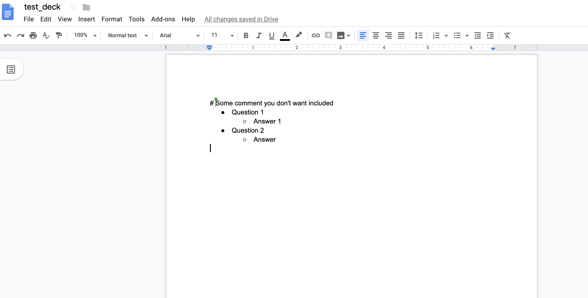

# anki-remote-decks

[](https://travis-ci.org/c-okelly/anki-remote-deck)

Anki add-on to allow users to create decks in Google Docs that can then be synced with Anki. The remote deck acts as the source of truth. When a user syncs, cards are added / updated / deleted in the local deck. When cards are updated (excluding the primary field) their history is preserved.

Official Add-on => [Anki Remote Decks](https://ankiweb.net/shared/info/911568091)

# Overview

* This add-on is still in beta and so only supports very basic functionality
* Only Basic cards are currently supported
* Support for text formatting
* More features will come in the future

GIF of adding a new deck


# Create a new deck

There are two steps:
* Creating a Google Doc
* Publishing the Google Doc

## Example remote deck


[Example Editable Google docs deck](https://docs.google.com/document/d/1fmGrSfiygvgUj2BXGMPH5PbI_M8ILh6pUfFjAZobOJQ)

[Example Published Google docs deck](https://docs.google.com/document/d/e/2PACX-1vRXWGu8WvCojrLqMKsf8dTOWstrO1yLy4-8x5nkauRnMyc4iXrwkwY3BThXHc3SlCYqv8ULxup3QiOX/pub)

## Creating Google doc

* Create a new Google Docs page
* Write your Questions and Answers in the following format using bullet points

```markdown
# Some comment you don't want included
* Question 1
  * Answer 1
* Question 2
  * Answer 2
```

An example is shown below:



This would produce the following:

  * A deck named ```test_deck```
  * Two basic notes with the associated questions and answers

## Publishing the Google docs

The Google Docs page must be published in order to be publically accessible.

* File > Publish to Web
* Click on the publish button


* The link provided is your key for syncing new decks.

An example published deck [Example Google docs deck](https://docs.google.com/document/d/e/2PACX-1vRXWGu8WvCojrLqMKsf8dTOWstrO1yLy4-8x5nkauRnMyc4iXrwkwY3BThXHc3SlCYqv8ULxup3QiOX/pub)


# Adding the deck to Anki


To add a new remote deck:

* Click on Tools => Manage Remote Decks => Add new remote deck
* Add the URL of your remote deck
* Click OK

The new deck will be added to Anki.

# Adding new content and syncing decks to update with changes

Go to the original Google doc and make the changes you wish to see.
It can take up to 5 minutes for changes to be published to the public version. Keep checking until you see your changes.

To sync all current remote decks:

* Click on Tools => Manage Remote Decks => Sync remote deck

GIF of adding new content and syncing


# Remove a remote deck

Removed decks are only unlinked from the remote doc. The local copy is not deleted.

* Click on Tools => Manage Remote Decks => Remove remote deck

# How does the add-on manage changes with note history?

* New notes are added without any history
* Notes removed from the Google doc are removed from the local deck
* If the answer section changes, the note is updated and history is preserved
* If the question line (primary field) changes, the old note is deleted and a new note is added.
  * History is lost for the note

# Formatting support

Currently the following formatting is supported:

* Bold
* Underlined
* Italics
* Colors

# Using Table of contents to sort your file

Users can now use a table of contents to index large files.

This will allows users to create contents at the top of the file and then creating headings throughout. These will be ignored when generating questions

# Manage image size

Images can be sized by change their size within the Google doc itself. The heigh and width in PX of the image is added to the Anki card.

# Controlling note type 

The note type can be set as follows:

This would set the note to a basic and reversed type:

```org
* Question line
# type = Basic (and reversed card)
    * Answer line
```

This would set the note to a Cloze:

```org
* When was Dublin founded {{c1::1204}}
# type=Cloze
    * Extra Info
```

# HTML list types => ```list```

    * Answers on cards are displayed as list
    * By default this will use an unordered

## Unordered list (Default)
```org
# list=ul
# list=unordered
```

Produces a card like below

```org
Question
_______________________________________________________________________
* Answer 1
* Answer 2
```

## Ordered list 
```org
# list=ol
# list=ordered
```

Produces a card like below

```org
Question
_______________________________________________________________________
1. Answer 1
2. Answer 2
```

## No list 
```org
# list=false
# list=None
```

Produces a card like below

```org
Question
_______________________________________________________________________
Answer 1
Answer 2
```

# Contributing

The repo is not really setup up currently for contributing. 

In order to package the repository run the following scripts. This will generate a zip with the required files for an Anki Add-on

```
./installOrgToAnki.sh
./package.sh
```

# Issues

If you have an issue please file a github issue! Thanks

# Future development

Future development will be tracked under issues as feature requests

# Contributors

Github user fneurohr22
